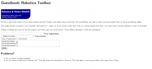
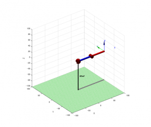

日本語の情報が全然ないうえ、英語の情報もけっこう少なくてわかりにくかったので
Peter Corke氏のRobotic Toolboxの使い方を紹介したいと思います。チュートリアルっぽく。

## Robotics Toolboxとは

無料で使える、ロボットのシミュレーション用のモデルやその運動の計算関数などがまとめて提供されているライブラリ。ロボットのモデルを作る、逆運動学や動力学の計算をする、動作のアニメーションをとる、などが簡単にできます。
ネットに出回っているような動力学の式を書く必要もないので、すぐにシミュレーションに移れます。あらかじめロボットのモデルもいくつか提供されており、ほんとにすぐに使えます。マジ便利。

### 始めかた

[Robotics Toolbox ダウンロードサイト](http://petercorke.com/Robotics_Toolbox.html)
まず上記サイトへ行き、"Downloading Toolbox"の項から文章中のリンク"here"をクリックする。
学生、企業社会人、その他など選択して登録する。

登録するとzipがダウンロードできる。解凍して、"rvctools" ごとまとめてMatlabの好きなディレクトリに移動。
Matlab上で使うときは、右クリックして「パスに追加　＞　選択フォルダとサブフォルダ」を使うか、
rvctools > startup_rvs.m を走らせる。

### モデルの作り方

基本的にはDHパラメータ記法に従って記述する…らしいがよくわからないので探り探り。
ロボットのモデルを作るには、SerialLinkという関数に、足したい自由度の数だけLinkオブジェクトを渡します。
とりあえず３自由度アームのサンプルコードを：

[matlab]
function robot = generate3DoF()

% robot length values, mass, diameter
len = [0 50 50];　%次の関節までの長さ。一つの部位に複数自由度を持たせる時は、(自由度数-1)だけ0が続く
mass = 1.0;　%関節同士を繋ぐ円柱の質量。今回は全部同じ値
dia = 2.0; % 円柱の直径

% inertia matrix: 慣性マトリクス。対角成分だけあれば一応動力学のトルク計算は出来るらしい
Ixx = (dia^2 / 4 + len.^2 /12 ) * mass;
Iyy = Ixx;
Izz = mass * dia^2 / 2;
% 関節の可動範囲指定。デフォルト（無指定）は[]と等しい
jointFix = [-1.5 1.5];

%% Link params
L(1) = Revolute('m', mass, 'I', [Ixx(1), Iyy(1), Izz],'r',[0,0,len(1)/2], 'qlim',jointFix,'alpha', pi/2, 'a', len(1), 'd', 0);
L(2) = Revolute('m', mass, 'I', [Ixx(2), Iyy(2), Izz],'r',[0,0,len(2)/2],'qlim',[],'alpha', 0, 'a', len(2), 'd', 0);
L(3) = Revolute('m', mass, 'I', [Ixx(3), Iyy(3), Izz],'r',[0,0,len(3)/2],'qlim',[],'alpha', -pi/2, 'a', len(3), 'd', 0);

% build a serial link manipulator

robot = SerialLink(L, 'name', '3DoF');
[/matlab]

これを
[matlab]
robot = generate3DoF();
robot.plot([0 0 0]);　% 各自由度の初期値
[/matlab]

みたいに実行して

こういう画面が出ればOKです。

### コードの補足説明

Linkのパラメータですが、
Revolute：指定すると回転軸不一致、指定しないとprismaticになって同じ軸で回転。
r:質量中心の座標
a,alpha,d: DHパラメータ系の値。thetaはplotするときに指定すればよい
robot.plot:各関節の初期角度値を指定。figureで表示。plotやscatter3も同じfigで追加表示できる

モデルの作り方のイメージは、
ひとつの関節の先端から継ぎ足して次の関節を生やしていく感じです。
他にもいくつかロボットのモデルが予め用意されているので(ex: mdl_baxter,mdl_naoなど)　それも見てみると非常に参考になるでしょう。

また、rvctools > robots > robot.pdf　が全てのマニュアルになってます（あんまり詳しくない）
読んで調べれば大体分かるんですが分かりにくいので　次回、逆運動学などよく使う関数系の注意点などまとめてみます。