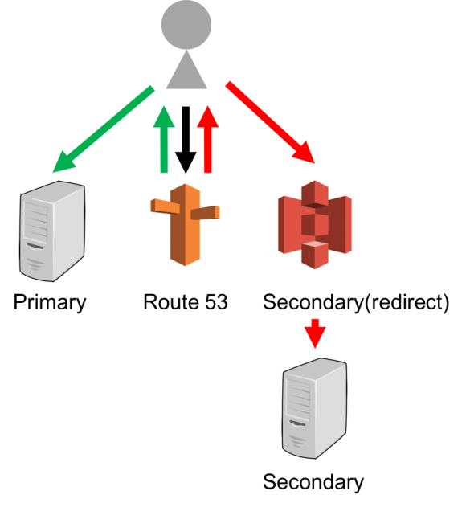

今回は、AWSのDNSフェイルオーバーをterraformで実現する手順を紹介します。

## やりたいこと

* webサーバーやそのインフラに障害が発生したときに、すぐに予備システムに切り替えたい
* その際、URLパスなどを編集したい

## DNSフェイルオーバーとは？

通常、DNSでURL名とIPアドレスが紐付いてると思います。
この宛先のIPアドレスを死活監視して、死んでいた場合に別の宛先へと切り替えることができる機能です。

### 利用シーン

例えばs3にsorryページを用意しておいて、本体が死んでしまったときにすぐ「サーバーが死んでてごめんなさい」を表示できます。
「ウチはELBを使って冗長化してるぜ！」という場合でも、ELB自体の障害には対応できません。
今回のDNSフェイルオーバーは、たとえELB自体が落ちていてもすぐに障害対応を行うことができます。

## S3の静的ウェブホスティング

上述のsorryページはどこに持つのか？という疑問については、S3の静的webホスティングという機能を使うことができます。
S3のSLAは99.9%、急に多くのtrafficが流れても耐えられるホットスタンバイを自力で構成する構築・運用コストを考えると、おそらくS3以上のものは難しいのではないでしょうか？（他にもいろいろあるんですかね？知らない

## 静的ウェブホスティングによるリダイレクト

sorryページがちゃんと表示できることは大事ですが、sorryページだけでは困る場合も多々あるのではないでしょうか。
そういった場合に、ホットスタンバイしておいた他のサーバーへのリダイレクトもS3だけで実現できます。
URLパラメータも引き継げます。URLパスも編集可能。

## 構成

図としてはこんな感じになります。
緑線が正常系、赤線が異常時のアクセスの流れになります。

[](../../../../src/assets/images/795316b92fc766b0181f6fef074f03fa.png)

今回はprimaryにAWS外部のサーバーを想定します。
ではterraformで作っていきます。

## 1\. Route53の設定

まず、Primary用のroute53設定を記述します。

```hcl
resource "aws_route53_record" "r53-sample" {
  zone_id = "${aws_route53_zone.myzone.id}"
  name = "example.jp"
  type = "A"
  ttl = "60"
  records = ["XXX.XXX.XXX.XXX"]

  health_check_id = "${aws_route53_health_check.hc-sample-dns-failover.id}"
  set_identifier = "sample-primary"
  failover_routing_policy {
    type = "PRIMARY"
  }
}
```

TTLが短いほど、DNSフェイルオーバーの切り替えが早くなります。今回は60sで設定。
ELBをprimaryに指定したときには、60秒以下にすることはできないようです。

次に、Primaryの生存確認のヘルスチェックの設定。

```hcl
resource "aws_route53_health_check" "hc-sample-dns-failover" {
  ip_address = "XXX.XXX.XXX.XXX"
  port = 80
  type = "HTTP"
  resource_path = "/check.html"
  failure_threshold = "2"  // 何回連続でヘルスチェックが失敗したら切り替えるか
  request_interval = "10"  // リクエストを送る間隔。 10 or 30 のみ使える 
}
```

この例だと、異常が起きてからホットスタンバイに移行するまで、最大で 60 + 10 * 2 = 80秒かかることになります。
TTLを短くするとその分お金もかかるので、コスト相談ですね。

では、secondaryの設定。

```hcl
resource "aws_route53_record" "r53-sample-redirector" {
  zone_id = "${aws_route53_zone.myzone.id}"
  name = "example.jp" // primaryと同じ
  type = "A"

  set_identifier = "sample-secondary"
  failover_routing_policy {
    type = "SECONDARY"
  }

  alias {
    name = "${aws_s3_bucket.redirector.website_domain}"
    zone_id = "${aws_s3_bucket.redirector.hosted_zone_id}"
    evaluate_target_health = false // s3の場合はfalse
  }
}
```

aliasの部分で、静的webホスティングの設定を入れます。

## 2\. 静的webホスティングの設定

webホスティングの設定を見ていきましょう。

```hcl
resource "aws_s3_bucket" "redirector" {
  bucket = "${aws_route53_record.r53-sample.name}"
  acl = "public-read"

  website {
    index_document = "index.html"
    error_document = "error.html"

    routing_rules = ＜＜EOF
[{
    "Redirect": {
        "HostName": "${var.redirect_hostname}",
        "HttpRedirectCode": "302" // defaultは301
    }
}]
EOF
  }

  logging {
    target_bucket = "${aws_s3_bucket.sample-log-bucket.id}"
    target_prefix = "log/"
  }
}
```

Redirectルールはjsonの形で記述してある部分になります。
一部URLパスだけ書き換えるなども簡単に記述することができます。詳細は[公式](http://docs.aws.amazon.com/ja_jp/AmazonS3/latest/user-guide/static-website-hosting.html)をどうぞ。
今回は、転送先とリダイレクト時のstatusコードを設定。defaultだと301なのですが、今回は障害時の一時的な転送になるので302を設定しました。
転送先はホスト名で指定している状態です。

logging のディレクティブで、ここに来たアクセスのログを書き出す設定ができます。
logを書き出すように別のバケットを準備します。

```hcl
resource "aws_s3_bucket" "sample-log-bucket" {
  bucket = "redirector-log"
  acl    = "log-delivery-write"
}
```

これで設定ができました。

## あれ

よく考えたらSecondaryでリダイレクトをせず、そのままホットスタンバイへ振り向けるするほうが全然需要ありそうだ。
ちょっと特殊な構成だったかもしれない…。

## 参考URL

[aws-の-dns-フェイルオーバーでサーバレス高可用性-sorry-ページを構築する](http://ceblog.mediba.jp/post/140328272267/aws-%E3%81%AE-dns-%E3%83%95%E3%82%A7%E3%82%A4%E3%83%AB%E3%82%AA%E3%83%BC%E3%83%90%E3%83%BC%E3%81%A7%E3%82%B5%E3%83%BC%E3%83%90%E3%83%AC%E3%82%B9%E9%AB%98%E5%8F%AF%E7%94%A8%E6%80%A7-sorry-%E3%83%9A%E3%83%BC%E3%82%B8%E3%82%92%E6%A7%8B%E7%AF%89%E3%81%99%E3%82%8B)
[amazon s3 redirect rule GET data is missing](http://stackoverflow.com/questions/23993675/amazon-s3-redirect-rule-get-data-is-missing)
