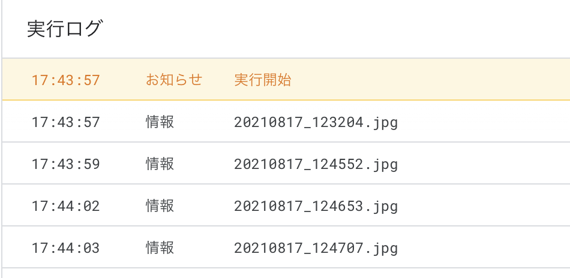
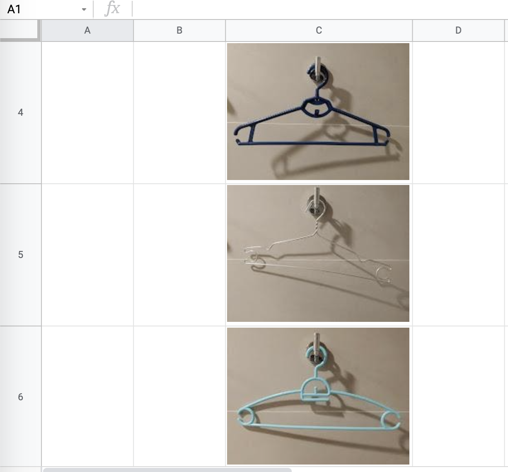

久しぶりの投稿です。
今回は、Google Sheetに画像を自動挿入する方法がネットにあんまりなかったのでシェアしておきます。

## やりたいこと

Google Sheetには画像を挿入する機能があります。
公式ドキュメントは[こちら](https://support.google.com/docs/answer/9224754?hl=ja&co=GENIE.Platform%3DDesktop)。

普通にやろうとすると１つ１つのセルをちまちま選択して『挿入 > 画像を挿入 > ...』を繰り返す必要があります。画像が多い場合は辛くて無理です。

一括挿入する方法としては、IMAGE関数を使ってまとめて処理することが選択肢になります。共有リンクを取得し、一部リンクを書き換えることで挿入可能になるようです。

[参考記事](https://roboma.io/blog/marketing/image-function-of-google-spreadsheet/)

参考までですが、共有リンクをまとめて取得する方法は[こちらをご参考ください](https://www.yukibnb.com/entry/2019/12/01/161500)。

が、画像の枚数が多いと表示が遅いケースがありました。
そこで今回は、画像をまとめて挿入するスクリプトを書いたので共有します。

## やったこと

#### Step1. 画像とスプレッドシートの準備

GoogleDriveのどこかのフォルダで

```
folderA - 画像を挿入したいスプレッドシート
        |
        |- folderB -- 画像1
                   |- 画像2
                   |- 画像3
                   |- ...
```

のように配置します。配置したら、folderBのフォルダIDをコピーしましょう。

#### Step2. スクリプトエディタでコード.gsを編集

次の通り。これを[こちらのブログ](https://www.yukibnb.com/entry/2019/12/01/161500)を参考にしてスクリプトエディタから起動すれば自動挿入されます。

```js

function insertImages() {
  const ss = SpreadsheetApp.getActiveSpreadsheet();
　// 選択中のシートに挿入される。必要ならシートIDを使って別途選択する
  const sh = ss.getActiveSheet();
　// Step1でコピーしたフォルダIDを貼り付け
  const folder = DriveApp.getFolderById("xxxxxxxxx");

  const folderFiles = folder.getFiles();
  // ファイル名でソート
  const sortedFiles = getSortedFiles(folderFiles);

  // 3列目に挿入する
  const colToInsert = 3;
  var rowCount = 2;
  for(let file of sortedFiles) {
    const fileName = file.getName();
    Logger.log(fileName);
    const fileId = file.getId();

    const obj = Drive.Files.get(fileId);
    const thumbnail = obj.thumbnailLink;
    //縦横比は3:4 or 4:3で想定。あまり正確ではない場合が多い
    //真面目にやるなら比率計算
    if (obj.imageMediaMetadata.width >= obj.imageMediaMetadata.height) {
      sh.insertImage(thumbnail, colToInsert, rowCount).setHeight(150).setWidth(200);
    } else if (obj.imageMediaMetadata.width === obj.imageMediaMetadata.height) {
      sh.insertImage(thumbnail, colToInsert, rowCount).setHeight(150).setWidth(150);
    } else {
      sh.insertImage(thumbnail, 3, rowCount).setHeight(150).setWidth(113);
    }
    rowCount = rowCount + 1;
  }
}

function getSortedFiles(folderFiles) {
  var sortedFiles = [];
  while(folderFiles.hasNext()) {
    var file = folderFiles.next();
    sortedFiles.push(file);
  }

  sortedFiles.sort(function(a,b){
    if(a.getName() < b.getName()) return -1;
    if(a.getName() > b.getName()) return 1;
    return 0;
  });
  return sortedFiles;
}

```

実行時に権限要求されますがよしなに許可。

実行するとファイル名が表示され、順次フォルダ内の画像がシートに挿入されていきます。

[](../../../../src/assets/images/gas-log.png)

挿入には少しラグがありますが、リロードするとちゃんと表示されます。

[](../../../../src/assets/images/gas-photo.png)

これでいろいろ捗ることもあるんじゃないでしょうか！
終！

### その他参考URL

- [how-to-insert-images-into-spreadsheets-by-gas](https://for-dummies.net/gas-noobs/how-to-insert-images-into-spreadsheets-by-gas/)
- [inserting-images-into-a-sheet-as-blobsource-using-google-apps-script](https://stackoverflow.com/questions/66782960/inserting-images-into-a-sheet-as-blobsource-using-google-apps-script)
